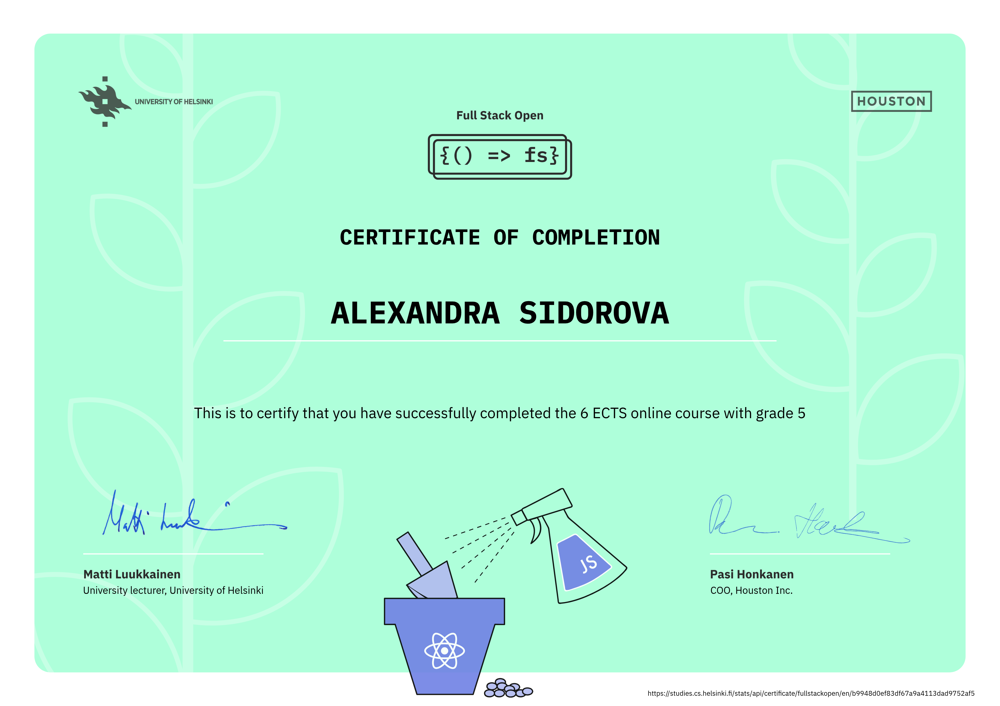
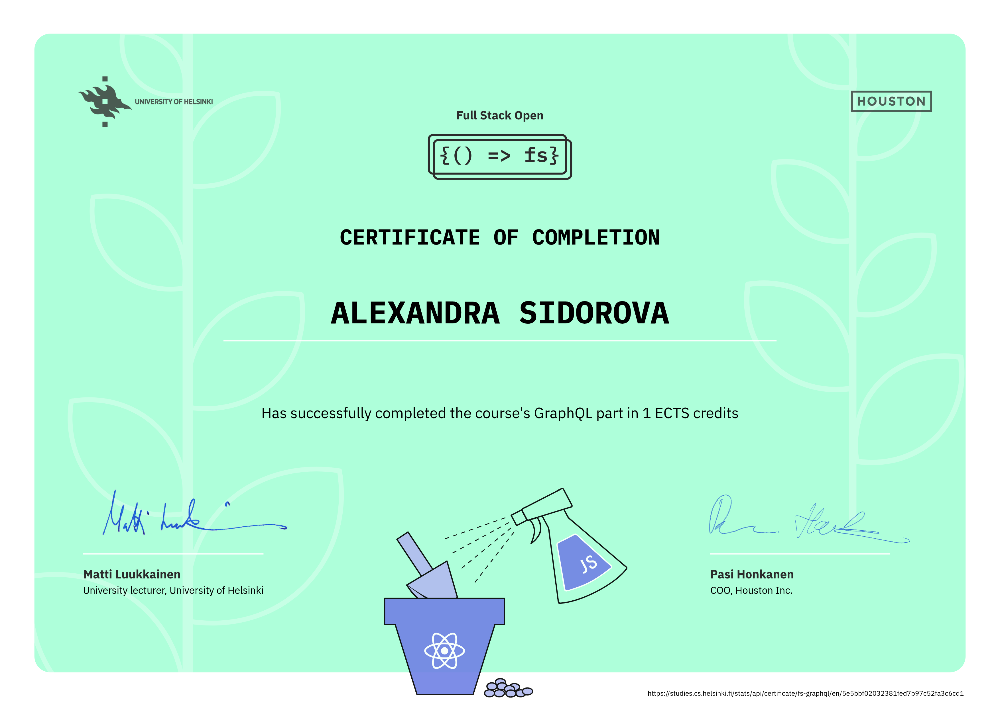

# Full Stack open
This is where I'm going to submit my exercises for the [Full Stack open course](https://fullstackopen.com/en/) from the University of Helsinki.

## Part 0. Fundamentals of Web apps
### a. General info
### b. Fundamentals of Web apps
Exercises 0.1 - 0.6: reading material on HTML and CSS, as well as three UML sequence diagrams illustrating the interaction between the browser and the server.

## Part 1. Introduction to React
### a. Introduction to React
### b. JavaScript
- `part1/courseinfo`: Exercises 1.1 - 1.5, refactoring a messy React component
### c. Component state, event handlers
### d. A more complex state, debugging React apps
- `part1/unicafe`: Exercises 1.6 - 1.11, a simple app for gathering feedback and displaying statistics
- `part1/anecdotes`: Exercises 1.12 - 1.14, a simple app for displaying random quotes and aphorisms and upvoting them

## Part 2. Communicating with server
### a. Rendering a collection, modules
- `part2/courseinfo`: Exercises 2.1 - 2.5, refactoring and generalizing the app from part 1 to support an arbitrary number of courses and course parts
### b. Forms
### c. Getting data from server
### d. Altering data in server
### e. Adding styles to React app
- `part2/phonebook`: Exercises 2.6 - 2.17, a simple phonebook app that communicates with a REST API server using Axios and allows filtering, adding, updating, and deleting records
- `part2/countries`: Exercises 2.18 - 2.20, a simple app that shows information about countries obtained via a REST API, including the current weather in the capital

## Part 3. Programming a server with NodeJS and Express
### a. Node.js and Express
### b. Deploying app to internet
### c. Saving data to MongoDB
### d. Validation and ESLint
- `part3/phonebook-backend`: Exercises 3.1 - 3.22, a simple Node/Express backend server that uses MongoDB via Mongoose to store data and provides a REST API that implements the CRUD operations for the phonebook app from part 2 (located in `part3/phonebook-frontend` with a few minor changes); [link to the full stack app deployed on Render](https://phonebook-32qc.onrender.com)

## Part 4. Testing Express servers, user administration
### a. Structure of backend application, introduction to testing
### b. Testing the backend
### c. User administration
### d. Token authentication
- `part4/bloglist-backend`: Exercises 4.1 - 4.23, a simple backend application that allows for user authentication and authorization and is tested using both unit testing and integration testing

## Part 5. Testing React apps
### a. Login in frontend
### b. props.children and proptypes
### c. Testing React apps
- `part5/bloglist-frontend`: Exercises 5.1 - 5.16, a simple React app with user login functionality that communicates with the backend from part 4 and is tested using Vitest
### d. End to end testing: Playwright
- `part5/bloglist-e2e-testing-playwright`: Exercises 5.17-5.23, end-to-end testing of the bloglist app with Playwright

## Part 6. Advanced state management
### a. Flux-architecture and Redux
- `part6/unicafe-redux`: Exercises 6.1-6.2, handling state management with Redux, with the reducer tested using Jest
### b. Many reducers
### c. Communicating with server in a Redux application
- `part6/anecdotes-redux`: Exercises 6.3-6.19, handling complex state management with Redux, Redux Toolkit, and Redux Thunk
### d. React Query, useReducer and the context
- `part6/anecdotes-query`: Exercises 6.20-6.24, server state management with React Query (TanStack Query) and frontend state management with the Context API and the useReducer hook

## Part 7. React router, custom hooks, styling app with CSS and webpack
### a. React Router
### b. Custom hooks
- `part7/anecdotes-query`: Exercises 7.1-7.6, working with React Router and custom hooks
- `part7/country-hook`: Exercise 7.7, implementing a custom hook that fetches data from a REST API
- `part7/ultimate-hooks`: Exercise 7.8, implementing a custom hook that communicates with the backend 
### c. More about styles
### d. Webpack
### e. Class components, Miscellaneous
### f. Exercises: extending the bloglist
- `part7/bloglist-backend`: Exercises 7.18-7.19, updating the backend app developed in part 4 to allow adding user comments on individual blog pages
- `part7/bloglist-frontend-query`: Exercises 7.9-7.21, updating the React app developed in part 5 to use React Query (TanStack Query) and Context for state management, React Router for views and navigation, and Styled componenents for styling
- `part7/bloglist-frontend-redux`: Exercises 7.9-7.21, updating the React app developed in part 5 to use Redux for state management, React Router for views and navigation, and Material UI for styling 

## Part 8. GraphQL
### a. GraphQL-server
### b. React and GraphQL
### c. Database and user administration
### d. Login and updating the cache
### e. Fragments and subscriptions
- `part8/library-backend`: Exercises 8.1-8.7, 8.13-8.16, and 8.23-8.26, a simple GraphQL backend server for a library, implemented using Apollo Server, that uses MongoDB via Mongoose to store data, subscriptions to send notifications to clients via WebSockets, and DataLoader to solve the n+1 problem
- `part8/library-frontend`: Exercises 8.8-8.12 and 8.17-8.26, a simple React app that uses the GraphQL server from `part8/library-backend` via Apollo Client, subscribes to server updates, and updates the cache of the Apollo client to avoid unnecessary queries

## Part 9. TypeScript
### a. Background and introduction
### b. First steps with TypeScript
- `part9/calculators`: Exercises 9.1-9.7, a simple Node/Express project written in TypeScript for calculating the body mass index and exercise statistics 
### c. Typing an Express app
- `part9/patientor-backend`: Exercises 9.8-9.14, a simple medical record application for doctors who handle diagnoses and basic health information of their patients
- `part9/patientor-frontend`: the pre-existing frontend for `part9/patientor-backend` that was provided as part of the course materials
### d. React with types

In progress...

---

**Certificate of completion for parts 0-7** ([verification link](https://studies.cs.helsinki.fi/stats/api/certificate/fullstackopen/en/b9948d0ef83df67a9a4113dad9752af5)):

---

**Certificate of completion for part 8** ([verification link](https://studies.cs.helsinki.fi/stats/api/certificate/fs-graphql/en/5e5bbf02032381fed7b97c52fa3c6cd1)):

