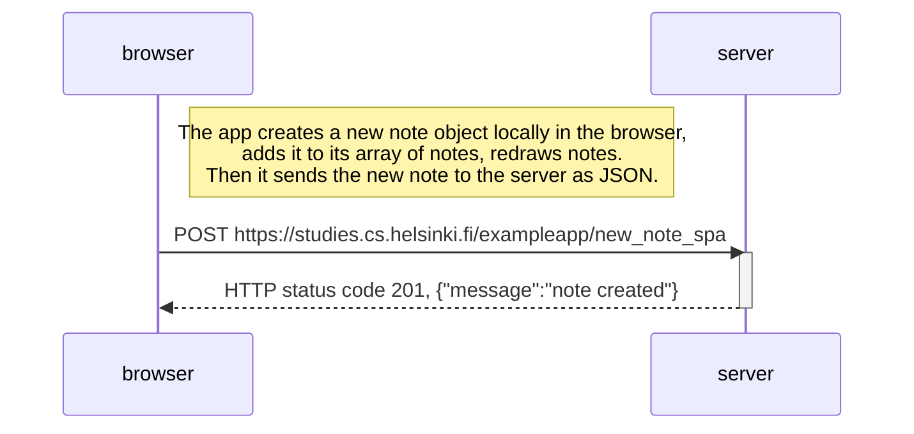

```mermaid

sequenceDiagram
    participant browser
    participant server

    Note right of browser: The app creates a new note object locally in the browser,<br/>adds it to its array of notes, redraws notes.<br/>Then it sends the new note to the server as JSON.

    browser->>server: POST https://studies.cs.helsinki.fi/exampleapp/new_note_spa
    activate server

    server-->>browser: HTTP status code 201, {"message":"note created"}
    deactivate server

```